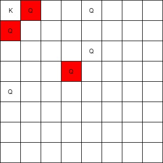
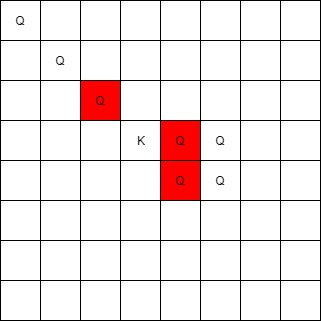
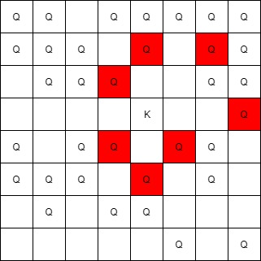

1222. Queens That Can Attack the King


Medium


On an 8x8 chessboard, there can be multiple Black Queens and one White King.

Given an array of integer coordinates queens that represents the positions of the Black Queens, and a pair of coordinates king that represent the position of the White King, return the coordinates of all the queens (in any order) that can attack the King.

 

Example 1:



```
Input: queens = [[0,1],[1,0],[4,0],[0,4],[3,3],[2,4]], king = [0,0]
Output: [[0,1],[1,0],[3,3]]
Explanation:  
The queen at [0,1] can attack the king cause they're in the same row. 
The queen at [1,0] can attack the king cause they're in the same column. 
The queen at [3,3] can attack the king cause they're in the same diagnal. 
The queen at [0,4] can't attack the king cause it's blocked by the queen at [0,1]. 
The queen at [4,0] can't attack the king cause it's blocked by the queen at [1,0]. 
The queen at [2,4] can't attack the king cause it's not in the same row/column/diagnal as the king.
```

Example 2:



```
Input: queens = [[0,0],[1,1],[2,2],[3,4],[3,5],[4,4],[4,5]], king = [3,3]
Output: [[2,2],[3,4],[4,4]]
```

Example 3:



```
Input: queens = [[5,6],[7,7],[2,1],[0,7],[1,6],[5,1],[3,7],[0,3],[4,0],[1,2],[6,3],[5,0],[0,4],[2,2],[1,1],[6,4],[5,4],[0,0],[2,6],[4,5],[5,2],[1,4],[7,5],[2,3],[0,5],[4,2],[1,0],[2,7],[0,1],[4,6],[6,1],[0,6],[4,3],[1,7]], king = [3,4]
Output: [[2,3],[1,4],[1,6],[3,7],[4,3],[5,4],[4,5]]
```

Constraints:

1 <= queens.length <= 63  
queens[0].length == 2   
0 <= queens[i][j] < 8   
king.length == 2   
0 <= king[0], king[1] < 8   
At most one piece is allowed in a cell.


## 方法


```go
func queensAttacktheKing(queens [][]int, king []int) [][]int {
    table:=make([][]int,8)
    result:=make([][]int,0)
    for i:=0;i<8;i++{
        table[i]=make([]int,8)
    }

    for i:=0;i<len(queens);i++{
        row:=queens[i][0]
        col:=queens[i][1]
        table[row][col]=1
    }

    

    row:=king[0]
    col:=king[1]
    //left
    for row<8{
        if table[row][col]==1{
            result=append(result,[]int{row,col})
            break
        }else {
            row++
        }
    }
    row=king[0]
    col=king[1]
    //left
    for row>=0{
        if table[row][col]==1{
            result=append(result,[]int{row,col})
            break
        }else {
            row --
        }
    }

    row=king[0]
    col=king[1]
    //left
    for col>=0{
        if table[row][col]==1{
            result=append(result,[]int{row,col})
            break
        }else {
            col --
        }
    }

    row=king[0]
    col=king[1]
    //left
    for col<8{
        if table[row][col]==1{
            result=append(result,[]int{row,col})
            break
        }else {
            col ++
        }
    }

    row=king[0]
    col=king[1]
    //left
    for row>=0 && col>=0{
        if table[row][col]==1{
            result=append(result,[]int{row,col})
            break
        }else {
            row --
            col --
        }
    }

    row=king[0]
    col=king[1]
    //left
    for row>=0 && col<8{
        if table[row][col]==1{
            result=append(result,[]int{row,col})
            break
        }else {
            row--
            col++
        }
    }

    row=king[0]
    col=king[1]
    //left
    for row<8 && col>=0{
        if table[row][col]==1{
            result=append(result,[]int{row,col})
            break
        }else {
            row ++
            col--
        }
    }

    row=king[0]
    col=king[1]
    //left
    for row<8 && col<8{
        if table[row][col]==1{
            result=append(result,[]int{row,col})
            break
        }else {
            row++
            col++
        }
    }
    return result
}


```


```python
class Solution:
    def queensAttacktheKing(self, queens: List[List[int]], king: List[int]) -> List[List[int]]:
        directions = [[0,1],[1,0],[1,1],[-1,0],[0,-1],[-1,-1],[1,-1],[-1,1]]
        x0,y0 = king
        queens = set(map(tuple,queens))
        res = []
        for x,y in directions:
            x1,y1 = x0+x, y0+y
            for i in range(8):
                if (x1 >= 0 and x1 <= 7) and (y1 >= 0 and y1 <= 7):
                    if (x1,y1) in queens:
                        res.append([x1,y1])
                        break
                x1 += x
                y1 += y
        return res
```