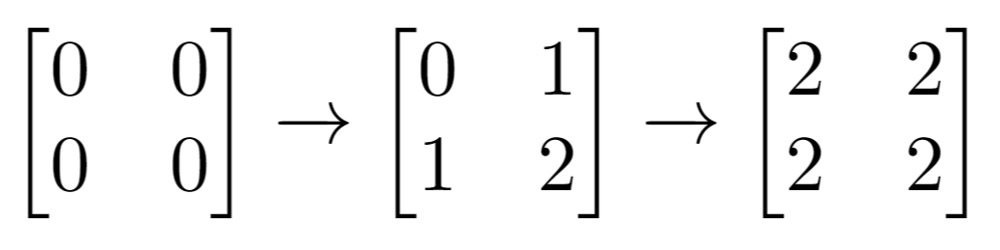

1252. Cells with Odd Values in a Matrix


Easy


Given n and m which are the dimensions of a matrix initialized by zeros and given an array indices where indices[i] = [ri, ci]. For each pair of [ri, ci] you have to increment all cells in row ri and column ci by 1.

Return the number of cells with odd values in the matrix after applying the increment to all indices.

 

Example 1:


```
Input: n = 2, m = 3, indices = [[0,1],[1,1]]
Output: 6
Explanation: Initial matrix = [[0,0,0],[0,0,0]].
After applying first increment it becomes [[1,2,1],[0,1,0]].
The final matrix will be [[1,3,1],[1,3,1]] which contains 6 odd numbers.
```

Example 2:



```
Input: n = 2, m = 2, indices = [[1,1],[0,0]]
Output: 0
Explanation: Final matrix = [[2,2],[2,2]]. There is no odd number in the final matrix.
```

Constraints:

1 <= n <= 50  
1 <= m <= 50  
1 <= indices.length <= 100  
0 <= indices[i][0] < n  
0 <= indices[i][1] < m


## 方法

```go
func oddCells(n int, m int, indices [][]int) int {
    row := make([]int, n)
    col := make([]int, m)
    
    for _, indice := range indices {
        row[indice[0]]++
        col[indice[1]]++
    }
    
    res := 0
    for _, v := range row {
        for _, vv := range col {
            if (v + vv) % 2 == 1 {
                res++
            }
        }
    }
    
    return res
}
```


```python
class Solution:
    def oddCells(self, n: int, m: int, indices: List[List[int]]) -> int:
        rows = [0] * n
        cols = [0] * m
        for x, y in indices:
            rows[x] += 1
            cols[y] += 1
        return sum((rows[x] + cols[y]) % 2 == 1 for x in range(n) for y in range(m))
```