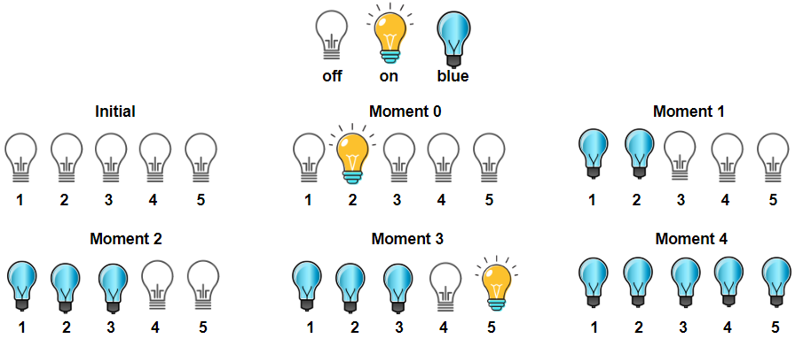

1375. Bulb Switcher III


Medium


There is a room with n bulbs, numbered from 1 to n, arranged in a row from left to right. Initially, all the bulbs are turned off.

At moment k (for k from 0 to n - 1), we turn on the light[k] bulb. A bulb change color to blue only if it is on and all the previous bulbs (to the left) are turned on too.

Return the number of moments in which all turned on bulbs are blue.

 

Example 1:



```
Input: light = [2,1,3,5,4]
Output: 3
Explanation: All bulbs turned on, are blue at the moment 1, 2 and 4.
```

Example 2:

```
Input: light = [3,2,4,1,5]
Output: 2
Explanation: All bulbs turned on, are blue at the moment 3, and 4 (index-0).
```

Example 3:

```
Input: light = [4,1,2,3]
Output: 1
Explanation: All bulbs turned on, are blue at the moment 3 (index-0).
Bulb 4th changes to blue at the moment 3.
```

Example 4:

```
Input: light = [2,1,4,3,6,5]
Output: 3
```

Example 5:

```
Input: light = [1,2,3,4,5,6]
Output: 6
```
 

Constraints:

n == light.length

1 <= n <= 5 * 10^4

light is a permutation of  [1, 2, ..., n]

## 方法

```go
func numTimesAllBlue(light []int) int {
    var (
        i       int
        rst     int
        maxOpen = 0
        length  = len(light)
    )
    for i = 0; i < length; i++ {
        if light[i] > maxOpen {
            maxOpen = light[i]
        }
        if maxOpen == i+1 {
            rst++
        }
    }
    return rst
}
```


```python
class Solution(object):
    def numTimesAllBlue(self, light):
        """
        :type light: List[int]
        :rtype: int
        """
        res = 0
        max_idx = 0
        for i, b in enumerate(light):
            max_idx = max(max_idx, b)
            if i+1 == max_idx:
                print b
                res+= 1
        return res
```