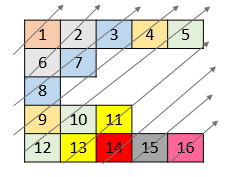

1424. Diagonal Traverse II


Medium


Given a list of lists of integers, nums, return all elements of nums in diagonal order as shown in the below images.
 

Example 1:


```
Input: nums = [[1,2,3],[4,5,6],[7,8,9]]
Output: [1,4,2,7,5,3,8,6,9]
```

Example 2:




```
Input: nums = [[1,2,3,4,5],[6,7],[8],[9,10,11],[12,13,14,15,16]]
Output: [1,6,2,8,7,3,9,4,12,10,5,13,11,14,15,16]
```

Example 3:

```
Input: nums = [[1,2,3],[4],[5,6,7],[8],[9,10,11]]
Output: [1,4,2,5,3,8,6,9,7,10,11]
```

Example 4:

```
Input: nums = [[1,2,3,4,5,6]]
Output: [1,2,3,4,5,6]
```
 

Constraints:

1 <= nums.length <= 10^5  
1 <= nums[i].length <= 10^5  
1 <= nums[i][j] <= 10^9  
There at most 10^5 elements in nums.


## 方法

```go
func findDiagonalOrder(mat [][]int) (ans []int) {
    order := [1e5][]int{}
	for i := len(mat) - 1; i >= 0; i-- {
		for j, v := range mat[i] {
			order[i+j] = append(order[i+j], v)
		}
	}
	for _, a := range order {
		for _, v := range a {
			ans = append(ans, v)
		}
	}
	return ans
}
```


```python
class Solution:
    def findDiagonalOrder(self, nums: List[List[int]]) -> List[int]:
        m = []
        for i, row in enumerate(nums):
          for j, v in enumerate(row):
            if i + j >= len(m):
                m.append([])
            m[i+j].append(v)
        return [v for d in m for v in reversed(d)]
```