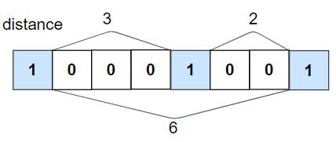
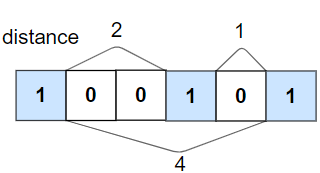

1437. Check If All 1's Are at Least Length K Places Away


Medium


Given an array nums of 0s and 1s and an integer k, return True if all 1's are at least k places away from each other, otherwise return False.

 

Example 1:



```
Input: nums = [1,0,0,0,1,0,0,1], k = 2
Output: true
Explanation: Each of the 1s are at least 2 places away from each other.
```

Example 2:



```
Input: nums = [1,0,0,1,0,1], k = 2
Output: false
Explanation: The second 1 and third 1 are only one apart from each other.
```

Example 3:

```
Input: nums = [1,1,1,1,1], k = 0
Output: true
```

Example 4:

```
Input: nums = [0,1,0,1], k = 1
Output: true
```
 

Constraints:

1 <= nums.length <= 10^5  
0 <= k <= nums.length  
nums[i] is 0 or 1  


## 方法

```go
func kLengthApart(nums []int, k int) bool {
    if k == 0 {
        return true
    }
    var prevIdx int = -k - 1
    for idx, num := range(nums) {
        if num == 1 {
            if idx - prevIdx <= k {
                return false
            } else {
                prevIdx = idx
            }
        }
    }
    return true
}
```


```python
class Solution:
    def kLengthApart(self, nums: List[int], k: int) -> bool:
        zero_num = 1e5
        for x in nums:
            if x == 1:
                if zero_num < k:
                    return False
                zero_num = 0
            else:
                zero_num += 1
        return True
```