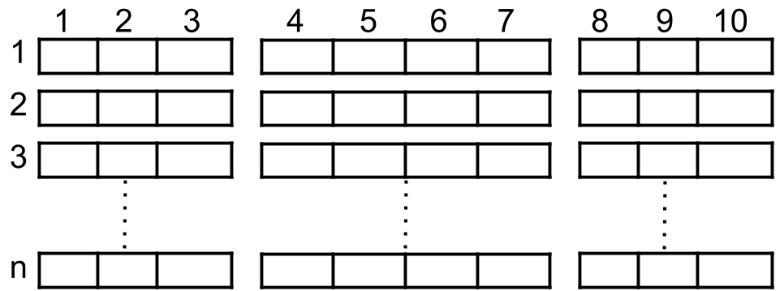
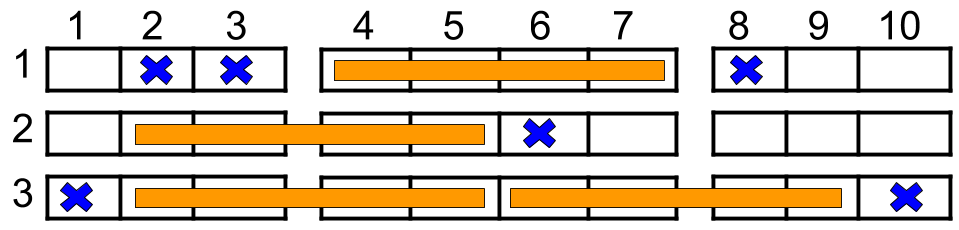

1386. Cinema Seat Allocation


Medium



A cinema has n rows of seats, numbered from 1 to n and there are ten seats in each row, labelled from 1 to 10 as shown in the figure above.

Given the array reservedSeats containing the numbers of seats already reserved, for example, reservedSeats[i]=[3,8] means the seat located in row 3 and labelled with 8 is already reserved. 

Return the maximum number of four-person families you can allocate on the cinema seats. A four-person family occupies fours seats in one row, that are next to each other. Seats across an aisle (such as [3,3] and [3,4]) are not considered to be next to each other, however, It is permissible for the four-person family to be separated by an aisle, but in that case, exactly two people have to sit on each side of the aisle.

 

Example 1:



```
Input: n = 3, reservedSeats = [[1,2],[1,3],[1,8],[2,6],[3,1],[3,10]]
Output: 4
Explanation: The figure above shows the optimal allocation for four families, where seats mark with blue are already reserved and contiguous seats mark with orange are for one family. 
```

Example 2:

```
Input: n = 2, reservedSeats = [[2,1],[1,8],[2,6]]
Output: 2
```

Example 3:

```
Input: n = 4, reservedSeats = [[4,3],[1,4],[4,6],[1,7]]
Output: 4
```

Constraints:

1 <= n <= 10^9  
1 <= reservedSeats.length <= min(10*n, 10^4)  
reservedSeats[i].length == 2  
1 <= reservedSeats[i][0] <= n  
1 <= reservedSeats[i][1] <= 10  
All reservedSeats[i] are distinct.


## 方法

```go
func maxNumberOfFamilies(n int, reservedSeats [][]int) int {
    blocked := make(map[int]int)
    for _, seat := range reservedSeats {
        row, col := seat[0], seat[1]-1
        blocked[row] |= 1 << col
    }
    
    count := 2*n
    for _, row := range blocked {
        left := (row & 0b11110) != 0
        center := (row & 0b1111000) != 0
        right := (row & 0b111100000) != 0
        if left && center && right {
            count -= 2
        } else if !(!left && !right) {
            count--
        }
    }
    return count
}
```


```python
class Solution(object):
    def maxNumberOfFamilies(self, n, reservedSeats):
        """
        :type n: int
        :type reservedSeats: List[List[int]]
        :rtype: int
        """
        seats = collections.defaultdict(int) 
        res = 0
		
        for row, col in reservedSeats:
            seats[row] = seats[row] | (1 << (col-1))

        for reserved in seats.values():
            curr = 0
            curr += (reserved & int('0111100000', 2)) == 0
            curr += (reserved & int('0000011110', 2)) == 0
            curr += (reserved & int('0001111000', 2)) == 0 and curr == 0

            res += curr    

        return res + 2 * (n - len(seats))
```