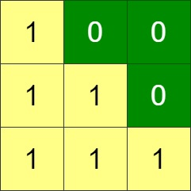

1536. Minimum Swaps to Arrange a Binary Grid


Medium


Given an n x n binary grid, in one step you can choose two adjacent rows of the grid and swap them.

A grid is said to be valid if all the cells above the main diagonal are zeros.

Return the minimum number of steps needed to make the grid valid, or -1 if the grid cannot be valid.

The main diagonal of a grid is the diagonal that starts at cell (1, 1) and ends at cell (n, n).

 

Example 1:


```
Input: grid = [[0,0,1],[1,1,0],[1,0,0]]
Output: 3
```

Example 2:


```
Input: grid = [[0,1,1,0],[0,1,1,0],[0,1,1,0],[0,1,1,0]]
Output: -1
Explanation: All rows are similar, swaps have no effect on the grid.
```

Example 3:



```
Input: grid = [[1,0,0],[1,1,0],[1,1,1]]
Output: 0
```
 

Constraints:

n == grid.length  
n == grid[i].length  
1 <= n <= 200  
grid[i][j] is 0 or 1


## 方法

```go
func minSwaps(grid [][]int) int {
    row := make([]int, len(grid))
	for i := range grid {
		for j := len(grid) - 1; j >= 0; j-- {
			if grid[i][j] == 0 {
				row[i]++
			} else {
				break
			}
		}
	}
	// 贪心算法。 row[i] >=len(grid)-1-i
	ans := 0
	for i := 0; i < len(row); i++ {
		//寻找
		last := row[i]
		for j := i; j < len(row); j++ {
			//寻找 找到了合适的。 把它挪到第一位。
			if row[j] >= len(grid)-1-i {
				ans += j - i
				row[j] = last
				break
			}
			if j == len(row)-1 {
				return -1
			}
			tmp := row[j]
			row[j] = last
			last = tmp
		}
	}
	return ans
}
```


```python
class Solution:
    def minSwaps(self, grid: List[List[int]]) -> int:
        need = 0
        l = len(grid)
        for i in range(l-1):
            for j in range(i, l):
                if sum(grid[j][i+1:]) == 0:
                    need += j-i
                    grid[i:j+1] = grid[j:j+1]+grid[i:j]
                    break
            else:
                return -1
        return need
```
