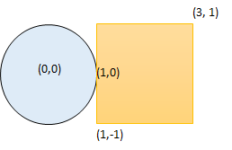
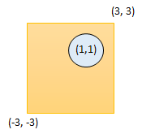

1401. Circle and Rectangle Overlapping


Medium


Given a circle represented as (radius, x_center, y_center) and an axis-aligned rectangle represented as (x1, y1, x2, y2), where (x1, y1) are the coordinates of the bottom-left corner, and (x2, y2) are the coordinates of the top-right corner of the rectangle.

Return True if the circle and rectangle are overlapped otherwise return False.

In other words, check if there are any point (xi, yi) such that belongs to the circle and the rectangle at the same time.

 

Example 1:



```
Input: radius = 1, x_center = 0, y_center = 0, x1 = 1, y1 = -1, x2 = 3, y2 = 1
Output: true
Explanation: Circle and rectangle share the point (1,0) 
```

Example 2:


```
Input: radius = 1, x_center = 0, y_center = 0, x1 = -1, y1 = 0, x2 = 0, y2 = 1
Output: true
```

Example 3:



```
Input: radius = 1, x_center = 1, y_center = 1, x1 = -3, y1 = -3, x2 = 3, y2 = 3
Output: true
```

Example 4:

```
Input: radius = 1, x_center = 1, y_center = 1, x1 = 1, y1 = -3, x2 = 2, y2 = -1
Output: false
```

Constraints:

1 <= radius <= 2000  
-10^4 <= x_center, y_center, x1, y1, x2, y2 <= 10^4  
x1 < x2  
y1 < y2  

## 方法

```go
func checkOverlap(radius int, x_center int, y_center int, x1 int, y1 int, x2 int, y2 int) bool {
    var dx, dy int;
    if x1 > x_center {
        dx = x1 - x_center  
    }else if x_center > x2 {
        dx = x_center - x2 
    }else {
        dx = 0
    }
    if y1 > y_center {
        dy = y1 - y_center  
    }else if y_center > y2 {
        dy = y_center - y2 
    }else {
        dy = 0
    }
    return dx * dx + dy * dy <= radius * radius
}
```


```python
class Solution:
    def checkOverlap(self, radius: int, x_center: int, y_center: int, x1: int, y1: int, x2: int, y2: int) -> bool:
        # 条件 1：首先判断圆心是否在矩形内
        if x1 <= x_center <= x2 and y1 <= y_center <= y2:
            return True
        # 条件 2：圆心位于矩形的上下左右四个区域
        elif x_center > x2 and y1 <= y_center <= y2: # 右
            return radius >= x_center - x2
        elif y_center < y1 and x1 <= x_center <= x2: # 下
            return radius >= y1 - y_center
        elif x_center < x1 and y1<= y_center <= y2: # 左
            return radius >= x1 - x_center
        elif y_center > y2 and x1 <= x_center <= x2: # 上
            return radius >= y_center - y2
        else:
        # 条件 3：判断矩形的四个顶点是否在圆的内部
            return min((x1 - x_center) ** 2 + (y2 - y_center) ** 2,\
                       (x2 - x_center) ** 2 + (y2 - y_center) ** 2, \
                       (x2 - x_center) ** 2 + (y1 - y_center) ** 2, \
                       (x1 - x_center) ** 2 + (y1 - y_center) ** 2) <= radius ** 2
```