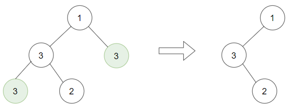

1325. Delete Leaves With a Given Value


Medium


Given a binary tree root and an integer target, delete all the leaf nodes with value target.

Note that once you delete a leaf node with value target, if it's parent node becomes a leaf node and has the value target, it should also be deleted (you need to continue doing that until you can't).

 

Example 1:


```
Input: root = [1,2,3,2,null,2,4], target = 2
Output: [1,null,3,null,4]
Explanation: Leaf nodes in green with value (target = 2) are removed (Picture in left). 
After removing, new nodes become leaf nodes with value (target = 2) (Picture in center).
```

Example 2:



```
Input: root = [1,3,3,3,2], target = 3
Output: [1,3,null,null,2]
```

Example 3:


```
Input: root = [1,2,null,2,null,2], target = 2
Output: [1]
Explanation: Leaf nodes in green with value (target = 2) are removed at each step.
```

Example 4:

```
Input: root = [1,1,1], target = 1
Output: []
```

Example 5:

```
Input: root = [1,2,3], target = 1
Output: [1,2,3]
```
 

Constraints:

1 <= target <= 1000   
The given binary tree will have between 1 and 3000 nodes.   
Each node's value is between [1, 1000].


## 方法


```go
/**
 * Definition for a binary tree node.
 * type TreeNode struct {
 *     Val int
 *     Left *TreeNode
 *     Right *TreeNode
 * }
 */
func removeLeafNodes(root *TreeNode, target int) *TreeNode {
    if root == nil {
		return root
	}
	root.Left= removeLeafNodes(root.Left, target)
	root.Right = removeLeafNodes(root.Right, target)
	if target==root.Val&&root.Left==nil&&root.Right==nil{
		return nil
	}
	return root
}
```


```python
# Definition for a binary tree node.
# class TreeNode:
#     def __init__(self, val=0, left=None, right=None):
#         self.val = val
#         self.left = left
#         self.right = right
class Solution:
    def removeLeafNodes(self, root: TreeNode, target: int) -> TreeNode:
        if not root:
            return None
        root.left = self.removeLeafNodes(root.left, target)
        root.right = self.removeLeafNodes(root.right, target)
        if not root.left and not root.right and root.val == target:
            return None
        return root
```
