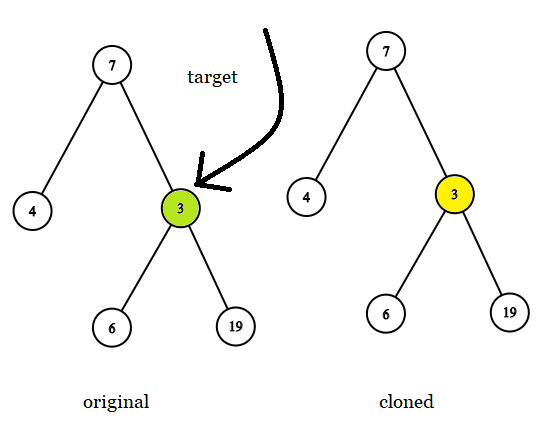
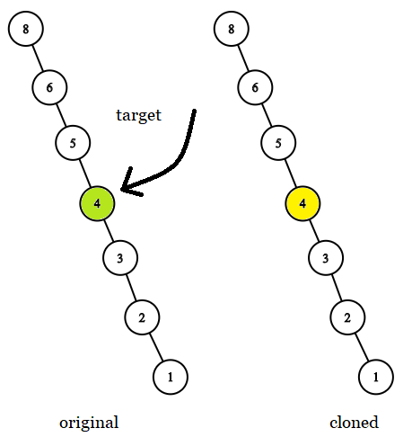
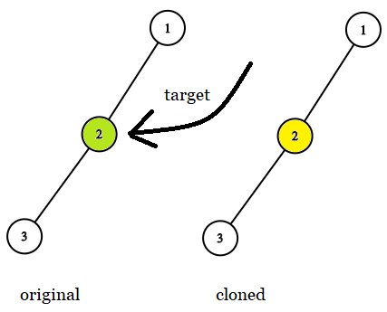

1379. Find a Corresponding Node of a Binary Tree in a Clone of That Tree


Medium


Given two binary trees original and cloned and given a reference to a node target in the original tree.

The cloned tree is a copy of the original tree.

Return a reference to the same node in the cloned tree.

Note that you are not allowed to change any of the two trees or the target node and the answer must be a reference to a node in the cloned tree.

Follow up: Solve the problem if repeated values on the tree are allowed.

 

Example 1:



```
Input: tree = [7,4,3,null,null,6,19], target = 3
Output: 3
Explanation: In all examples the original and cloned trees are shown. The target node is a green node from the original tree. The answer is the yellow node from the cloned tree.
```

Example 2:


```
Input: tree = [7], target =  7
Output: 7
```

Example 3:



```
Input: tree = [8,null,6,null,5,null,4,null,3,null,2,null,1], target = 4
Output: 4
```

Example 4:


```
Input: tree = [1,2,3,4,5,6,7,8,9,10], target = 5
Output: 5
```

Example 5:



```
Input: tree = [1,2,null,3], target = 2
Output: 2
```
 

Constraints:
 
The number of nodes in the tree is in the range [1, 10^4].  
The values of the nodes of the tree are unique.   
target node is a node from the original tree and is not null.   


## 方法


```python
# Definition for a binary tree node.
# class TreeNode:
#     def __init__(self, x):
#         self.val = x
#         self.left = None
#         self.right = None

class Solution:
    def getTargetCopy(self, original: TreeNode, cloned: TreeNode, target: TreeNode) -> TreeNode:
        def traverse(original, cloned, target):
            if not original or not cloned:
                return None
            
            if original == target:
                return cloned
            
            return traverse(original.left, cloned.left, target) or \
                traverse(original.right, cloned.right, target)
        return traverse(original, cloned, target)
```